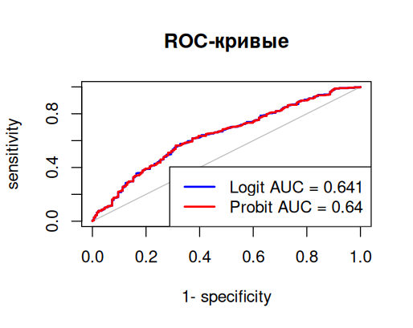
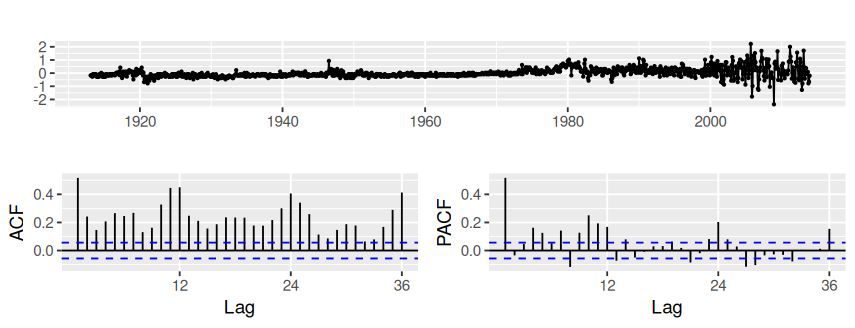
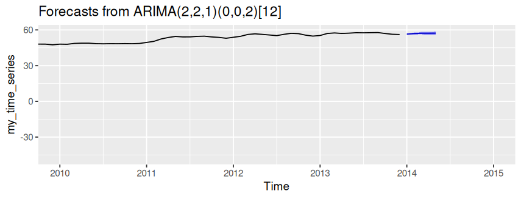
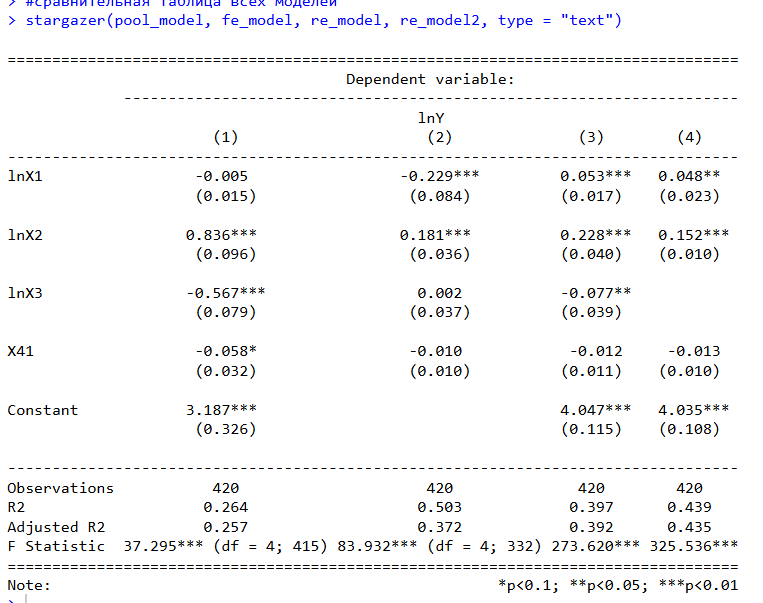

# Econometrics & Time Series Analysis

**Tools:** R · plm · forecast · tseries · urca · lmtest · car · tidyverse

## Overview

Подборка учебных исследований по эконометрике и анализу временных рядов, выполненных в R.

Проекты включают работу с панельными данными, регрессионными моделями и временными рядами. В исследованиях использовались реальные экономические и статистические данные, проводилась проверка качества моделей и интерпретация полученных результатов.

## Panel Data Analysis

### Regional Economic Analysis

Исследование взаимосвязи социально-экономических показателей регионов и обеспеченности населения автомобилями.

Для анализа использована панель данных из 84 регионов России за 2020–2024 гг. Общее количество наблюдений составляет 420.

В качестве факторов рассматривались жилищный фонд, потребительские расходы на душу населения, доходы на душу населения и показатель предпринимательского дохода.

В рамках исследования проведены:

* построение моделей с фиксированными и случайными эффектами;
* сравнение спецификаций с помощью теста Хаусмана;
* оценка статистической значимости факторов;
* проверка мультиколлинеарности с использованием VIF;
* проведение теста Вальда;
* интерпретация коэффициентов моделей с учетом экономического смысла показателей.

В модели с фиксированными эффектами статистически значимыми оказались показатели жилищного фонда и потребительских расходов. Коэффициенты при них составили -0.229 и 0.181 соответственно.

## Time Series Analysis

### Consumer Price Index

Исследование динамики индекса потребительских цен с использованием методов анализа временных рядов.

В рамках работы проведены анализ временной структуры ряда, приведение ряда к стационарному виду, детрендирование ряда,  проверка его свойств и подбор модели прогнозирования с учетом сезонности.

Для построения прогноза использован автоматический подбор ARIMA-модели. В результате выбрана модель **ARIMA(2,2,1)(0,0,2)[12]**.

Дополнительно проведена диагностика остатков и проверка их свойств с использованием тестов Box-Ljung, Shapiro-Wilk и Jarque-Bera.

## Regression Analysis

Отдельные учебные работы были посвящены построению и анализу регрессионных моделей на экономических данных.

В рамках исследований проводились:

* оценка влияния факторов на зависимую переменную
* проверка статистической значимости коэффициентов
* анализ мультиколлинеарности 
* сравнение различных спецификаций
* экономическая интерпретация результатов

## Visualizations & Results

Здесь представлены отдельные результаты исследований: графики временных рядов, результаты регрессионного анализа, таблицы коэффициентов и диагностические материалы.

1) График ROC-кривой с показателями Logit AUC и Probit AUC в работе по исследованию модели бинарного выбора:

Ссылка на работу в Rstudio: "idz econometric" with you on Posit Cloud: https://posit.cloud/content/12238419

2) Графики ACF и PACF стационаризированного ряда и прогнозирования модели на 5 периодов в работе по исследованию CPI (индекса потребительских цен) в США с 1913 по 2014 года (исследование временного ряда)

Ссылка на работу в Rstudio: "IDZ_2" with you on Posit Cloud: https://posit.cloud/content/12513544

3) Результаты сравнения трех моделей: сквозной регрессии, модели случайных эффектов и модели фиксированных эффектов в работе по исследованию панельных данных 84 регионов России за 5 лет (исследуемый показатель - обеспеченность личным автомобилем на 1000 человек населения в регионе)

Ссылка на работу в Rstudio: "econometrica" with you on Posit Cloud: https://posit.cloud/content/12581191

## Key Skills

`R` `Econometrics` `Regression Analysis` `Panel Data` `Time Series` `ARIMA` `Statistical Testing` `Model Diagnostics` `Data Visualization`

## Project Type

Academic projects
